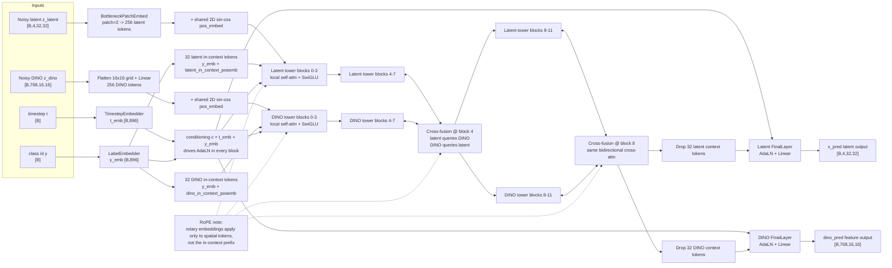

# JiT Dual-Stream Base Data Flow

Example shown for the custom model trained in [`sbatch/jit_training.sbatch`](../sbatch/jit_training.sbatch):

- Model: `JiT-Dual-B/2-4C-896`
- Latent input: `[B,4,32,32]`
- DINO input: `[B,768,16,16]`
- Hidden size: `896`
- Context tokens per stream: `32`
- Cross-fusion layers: `4` and `8`

## Notes

- The latent and DINO streams keep separate transformer weights all the way through the network.
- Both streams receive the same timestep/class conditioning vector `c`, but each stream has its own learned in-context positional embeddings.
- Cross-fusion is bidirectional: the latent stream attends to DINO features, and the DINO stream attends back to latent features.
- The model predicts both the denoised latent and the denoised DINO feature map at every sampling step.

## How To Render

1. Open this Markdown file in a Mermaid-capable preview.
2. Or render the raw file directly with:
   - `mmdc -i JiT/jit_dual_stream_dataflow.mmd -o JiT/jit_dual_stream_dataflow.svg`
