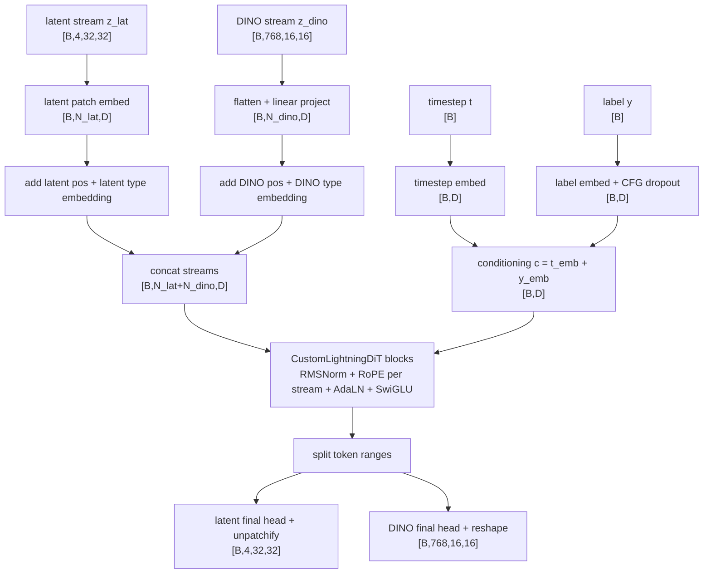

# CustomDiT Data Flow Diagram

Example shown for `CustomDiT-B/2-4C`, `latent_size=32`, `dino_patches=16`, `B=8`.

Notes:

- `N_lat = (latent_size / latent_patch_size)^2`; for `CustomDiT-B/2-4C`, `N_lat = 256`.
- `N_dino = dino_patches^2`; with the default DINO grid, `N_dino = 256`.
- For `/4-4C` variants, only the latent token count changes; the DINO stream stays on the original shard contract.
